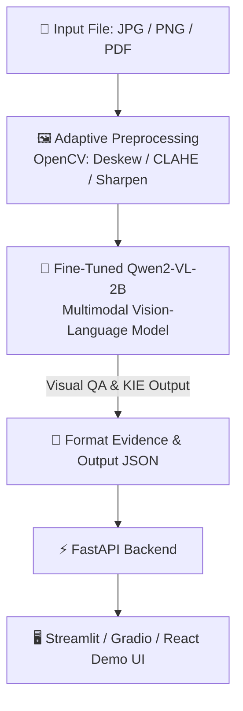

# 📄 Document Visual Question Answering System Using End-to-End Vision-Language Model (Qwen2-VL)

> Hướng dẫn cài đặt và chạy đầy đủ frontend, backend và Qwen2-VL: [RUNNING.md](RUNNING.md).

> **Hệ thống Hỏi - Đáp và Trích xuất thông tin tự động trên Tài liệu / Hóa đơn tiếng Việt ứng dụng mô hình Thị giác - Ngôn ngữ (VLM) Qwen2-VL & Kỹ thuật Fine-Tuning QLoRA.**

---

## ✨ Features

- 🎯 **End-to-End VLM Architecture:** Nhận trực tiếp hình ảnh/tài liệu và câu hỏi, trả lời trực tiếp mà không cần qua pipeline OCR/KIE trung gian, triệt tiêu lỗi rò rỉ dây chuyền (Cascading Error).
- 🖼️ **Adaptive Preprocessing Engine:** Tiền xử lý tự động với OpenCV (Deskew xoay thẳng góc, CLAHE tăng tương phản, Sharpening khử mờ, Auto-Crop).
- 🧾 **Multi-task Extraction & QA:** Vừa trích xuất thực thể hóa đơn (Mã số thuế, Ngày lập, Tổng tiền, Tên người bán) vừa giải đáp câu hỏi kiểm toán logic.
- ⚡ **Tối ưu hóa Chi phí (Frugal AI):** Huấn luyện QLoRA hoàn toàn miễn phí trên **Kaggle GPU T4 (16GB VRAM)** và triển khai nhẹ nhàng trên CPU/GPU local.
- 📊 **Metrics Đánh giá Chuẩn:** Đánh giá độ chính xác với **ANLS (Average Normalized Levenshtein Similarity)**, **Exact Match (EM)**, **F1-Score** và **Inference Latency**.

---

## 🛠️ Tech Stack & Hạ tầng

- **AI / VLM Base Model:** `Qwen/Qwen2-VL-2B-Instruct`
- **Fine-Tuning & Quantization:** PyTorch, Hugging Face `transformers`, `peft` (QLoRA), `bitsandbytes`, `qwen-vl-utils`
- **Image Preprocessing:** OpenCV, Pillow, PyMuPDF
- **Backend / API:** FastAPI, Uvicorn
- **Frontend / Demo:** Streamlit / Gradio & React (Vite)
- **Database:** SQLite
- **Hardware Requirement:**
  - **Training:** Kaggle GPU Tesla T4 (16GB VRAM) / Google Colab T4
  - **Inference:** CPU 8GB+ RAM hoặc GPU Nvidia (tối thiểu 4GB VRAM)

---

## 📐 System Pipeline



---

## 📚 Datasets Huấn luyện

Tập trung vào 2 bộ dữ liệu đại diện đã được chuẩn hóa về định dạng Qwen2-VL Conversation format:
1. **SROIE (Scanned Receipts Information Extraction):** Tập dữ liệu bóc tách thực thể hóa đơn (Vendor, Date, Tax Code, Total).
2. **MCOCR:** Tập dữ liệu bóc tách thông tin hóa đơn tiếng Việt (Shop Name, Total, Items).
3. **VietnamReceiptsV3:** TTập dữ liệu trích xuất thông tin hóa đơn tiếng Việt nâng cao.

---

## ⚙️ Getting Started

### Prerequisites

- Python >= 3.10
- CUDA >= 12.1 (dành cho GPU) hoặc CPU 8GB+ RAM

### Installation
++ 
1. **Clone repository:**
   ```bash
   git clone https://github.com/nbquoclong-bit/Document-Visual-Question-Answering-System.git
   cd Document-Visual-Question-Answering-System
   ```

2. **Cài đặt môi trường:**
   ```bash
   pip install -r model/stage1_vlm/requirements.txt
   ```

3. **Huấn luyện mô hình (trên Kaggle GPU):**
   ```bash
   cd model
   PYTHONPATH=. python -m stage1_vlm.src.prepare_vlm_data
   PYTHONPATH=. python -m stage1_vlm.src.trainer
   ```

4. **Chạy thử nghiệm Inference (Local):**
   ```bash
   cd model
   python test_vlm.py
   ```

5. **Khởi chạy Backend (FastAPI):**
   ```bash
   cd backend/backend-docvqa/backend
   python -m uvicorn app.main:app --reload --port 8000
   ```

---

## 📂 Project Structure

```text
Document-Visual-Question-Answering-System/
├── model/
│   ├── stage0_preprocessing/   # Module tiền xử lý ảnh (OpenCV)
│   ├── stage1_vlm/             # Pipeline Fine-tune Qwen2-VL-2B (QLoRA)
│   │   ├── configs/            # Config huấn luyện (train_config.yaml)
│   │   ├── src/                # Trainer, Dataset, Model & Inference
│   │   └── requirements.txt
│   ├── output/                 # Thư mục chứa weights (lora_adapters)
│   └── test_vlm.py             # Script kiểm thử VLM độc lập
├── backend/                    # FastAPI Backend Server
├── frontend/                   # React Web UI Dashboard / Gradio Demo
├── datasets/                   # Dữ liệu SROIE & ViOCRVQA
└── README.md
```

---

## 👥 Authors & Roles

| Thành viên | MSSV | Vai trò chính | Nhiệm vụ chi tiết |
| :--- | :---: | :--- | :--- |
| **Nguyễn Bá Quốc Long** | *(Điền MSSV)* | **Team Leader & VLM Lead** | Quản lý dự án, Fine-tune mô hình **Qwen2-VL-2B** bằng QLoRA trên Kaggle GPU. |
| **Nguyễn Văn Nhật Nam** | *25521168* | **Data Engineer** | Tiền xử lý, gán nhãn và chuẩn hóa 2 bộ dataset (**SROIE** & **MCOCR** & **VietnamReceiptsV3**) sang FUNSD format. |
| **Lê Minh Sang** | *(Điền MSSV)* | **AI Evaluation Lead** | Xây dựng pipeline đánh giá, tính toán chỉ số **ANLS**, **Exact Match (EM)**, **F1-Score** & **Latency**. |
| **Trần Hoàng Minh Thiên** | *2550222* | **Backend Engineer** | Lập trình RESTful API với **FastAPI**, kết nối pipeline VLM và lưu trữ SQLite. |
| **Trịnh Minh Đức Hoàng** | *(Điền MSSV)* | **Frontend & Demo Lead** | Phát triển giao diện Demo (**Gradio/Streamlit** & **React Web UI**) và thực hiện video demo. |

---

## 📄 License

Dự án phát triển phục vụ mục đích học tập và nghiên cứu môn học ML/IoT.
