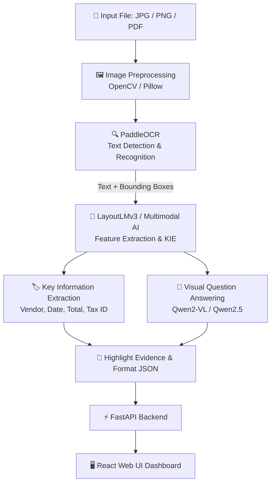

# Document Visual Question Answering System Using OCR and Multimodal Architecture for Automated Document Processing
## Authors

* [Nguyễn Bá Quốc Long](https://github.com/nbquoclong-bit)
* [Lê Minh Sang](https://github.com/LeMinhSang241)
* [Nguyễn Văn Nhật Nam](https://github.com/uynd)
* [Trần Hoàng Minh Thiên](https://github.com/TranHoangMinhThien)
* [Trịnh Minh Đức Hoàng](https://github.com/Emiya2902)

## System Pipeline

## Dataset
