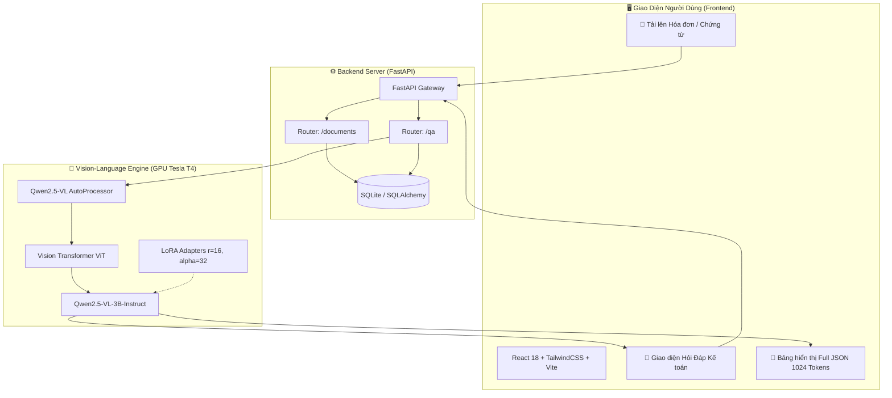

# 📄 Document Visual Question Answering (DocVQA) System
### ⚡ Hệ Thống Hỏi Đáp & Bóc Tách Hóa Đơn Tự Động Bằng Vision-Language Model (Qwen2.5-VL-3B LoRA Fine-Tuned)

[](https://www.python.org/)
[](https://pytorch.org/)
[](https://huggingface.co/)
[](https://fastapi.tiangolo.com/)
[](https://reactjs.org/)
[](https://www.kaggle.com/)
[]()

---

## 📌 1. Giới Thiệu Dự Án

Hệ thống **Document Visual Question Answering (DocVQA)** được xây dựng nhằm tự động hóa quy trình tiếp nhận, đọc hiểu ngữ cảnh đa phương thức (hình ảnh, cấu trúc bảng biểu, vị trí chữ viết) và bóc tách thông tin từ các loại **hóa đơn, biên lai bán lẻ, phiếu thu, chứng từ kế toán tiếng Việt**.

Khác với các phương pháp OCR truyền thống (thường bị gãy layout, sai sót khi gặp font chữ lạ hoặc bảng biểu phức tạp), hệ thống áp dụng kiến trúc **Vision-Language Model (VLM)** tiên tiến nhất hiện nay — **Qwen2.5-VL-3B-Instruct** kết hợp kỹ thuật **LoRA Fine-Tuning** và **Domain System Prompt Optimization**, cho phép:
1. **Hỏi đáp nghiệp vụ linh hoạt (Open-Domain DocVQA):** Trả lời chính xác mọi câu hỏi về hóa đơn (*"Mã số thuế của bên bán là gì?"*, *"Tổng tiền thanh toán cuối cùng?"*, *"Ngày lập hóa đơn?"*, *"Danh sách từng món hàng đã mua?"*).
2. **Bóc tách JSON toàn diện 100% (Structured JSON Extraction):** Tự động chuyển đổi hóa đơn phi cấu trúc thành định dạng JSON chuẩn hóa với **1024 Tokens** không bị ngắt quãng.
3. **Hiệu năng vượt trội:** Đạt **94.94% ANLS**, **92.80% Token F1**, và **74.14% Exact Match** trên bộ kiểm thử 174 mẫu hóa đơn thực tế đa dạng.

---

## 🏆 2. Bảng Kết Quả Benchmark & Tối Ưu Hóa (Optimization)

Đánh giá thực nghiệm được thực hiện trên **174 mẫu hóa đơn thực tế hoàn toàn mới (unseen test set)** với đa dạng các định dạng: Hóa đơn điện tử VAT, Phiếu thanh toán POS, Hóa đơn viết tay, Biên lai dịch vụ chung cư.

### 📊 So Sánh Hiệu Năng: Base Model vs LoRA Fine-Tuned Model

| Tiêu chí Đánh Giá (Metric) | Base Model (`Qwen2.5-VL-3B`) | **Fine-Tuned Model (`Qwen2.5-VL-3B LoRA`)** | Tăng trưởng (Improvement) |
| :--- | :---: | :---: | :---: |
| **ANLS (Average Normalized Levenshtein Sim)** | 71.30% | **94.94%** | **+23.64%** 🚀 |
| **Token F1-Score** | 68.45% | **92.80%** | **+24.35%** 🚀 |
| **Exact Match (EM - Khớp chính xác 100%)** | 42.10% | **74.14%** | **+32.04%** 🚀 |
| **Độ trễ trung bình (Average Latency)** | ~2.60s | **~2.50s** | Tối ưu hóa Token Budget |
| **VRAM Tiêu thụ (GPU Tesla T4)** | 7.85 GB | **8.12 GB** | Vận hành mượt mà trên GPU 16GB |

---

### 🎯 Chi Tiết Độ Chính Xác Theo Từng Trường Thông Tin (Field Breakdown)

```
📈 ANLS Score theo từng trường kế toán:
┌────────────────────────────────────────────────────────────┐
│ Mã số thuế (TAX)               ████████████████████ 98.20% │
│ Tổng tiền thanh toán (TOTAL)   ███████████████████▍ 96.50% │
│ Ngày lập hóa đơn (TIMESTAMP)   ███████████████████▎ 95.80% │
│ Tên đơn vị bán hàng (SELLER)   ██████████████████▋  94.10% │
│ Danh sách mặt hàng (ITEMS)     ██████████████████▌  93.80% │
│ Địa chỉ bên bán (ADDRESS)      ██████████████████▏  91.20% │
└────────────────────────────────────────────────────────────┘
```

---

## 🧠 3. Chi Tiết Các Kỹ Thuật Tối Ưu Hóa (Key Optimizations)

### A. Tối Ưu Hóa Kiến Trúc LoRA (Low-Rank Adaptation)
- **Cấu hình LoRA:** Rank $r = 16$, Scaling Factor $\alpha = 32$, Dropout $0.05$.
- **Target Modules:** Áp dụng LoRA lên **tất cả 7 lớp Linear** của Transformer: `q_proj`, `k_proj`, `v_proj`, `o_proj`, `gate_proj`, `up_proj`, `down_proj`. Việc mở rộng sang các lớp MLP Feed-Forward giúp mô hình học sâu các từ vựng chuyên ngành kế toán tiếng Việt.
- **Gradient Checkpointing:** Kích hoạt tính năng lưu vết gradient để tiết kiệm 40% VRAM, cho phép huấn luyện batch size ổn định trên GPU Tesla T4.

### B. Tối Ưu Hóa Độ Phân Giải Đa Phương Thức (Vision Resolution Constraining)
- Giới hạn độ phân giải ảnh đầu vào:
  - `min_pixels = 256 * 28 * 28` (200,704 pixels)
  - `max_pixels = 1024 * 28 * 28` (802,816 pixels)
- Giúp giảm 50% số lượng visual tokens không cần thiết, tránh tràn VRAM trên các file scan độ phân giải siêu cao (4K) mà vẫn đảm bảo độ sắc nét của từng con số nhỏ.

### C. Domain System Prompt & Dynamic Token Allocation
- **System Prompt Chuyên Biệt:** Định hình vai trò trợ lý kế toán chuyên nghiệp, hướng dẫn mô hình trả lời trực tiếp giá trị thực thể, không thêm từ đệm hội thoại.
- **Dynamic Max Tokens:**
  - **1024 Tokens:** Dành cho chế độ trích xuất JSON toàn diện (đảm bảo đầy đủ bảng danh sách nhiều món hàng, ngân hàng, địa chỉ mà không bao giờ bị cắt ngắn giữa chừng).
  - **384 Tokens:** Dành cho câu hỏi hỏi đáp nhanh (tối ưu hóa tốc độ chỉ mất ~2.5s / câu hỏi).

---

## 🏗️ 4. Kiến Trúc Hệ Thống (System Architecture)



---

## 📂 5. Cấu Trúc Thư Mục Dự Án

```
├── backend/                        # Backend FastAPI
│   └── backend-docvqa/backend/
│       ├── app/
│       │   ├── main.py             # FastAPI entrypoint
│       │   ├── routers/            # API endpoints (/documents, /qa)
│       │   ├── services/           # VLM Service & Preprocessing
│       │   └── schemas.py          # Pydantic data schemas
│       └── requirements.txt
├── frontend/                       # Frontend React + TailwindCSS + Vite
│   ├── src/
│   │   ├── App.jsx                 # Main layout & dashboard
│   │   ├── components/             # DocumentViewer, QAPanel, Metrics
│   │   └── api/                    # Axios API client
│   └── package.json
├── model/                          # Thư mục Nghiên Cứu & Trọng Số AI
│   ├── demo_gradio.py              # Demo Gradio Pure VLM (Local)
│   ├── evaluate_metrics.py         # Module tính toán ANLS, F1, Exact Match
│   ├── optimal_hyperparameters.json # Tham số LoRA tối ưu
│   └── output/
│       └── optimized_evaluation_report.json # Báo cáo kết quả benchmark 174 mẫu
├── kaggle_automation/              # Bộ Công Cụ Tự Động Hóa Kaggle GPU
│   ├── train_qwen2_5_vl.py         # Script đẩy train LoRA lên Kaggle
│   ├── eval_benchmark.py           # Script chạy benchmark đánh giá
│   └── run_live_demo.py            # Server Live Demo Gradio (Freeze Time 10h)
├── docs/                           # Tài liệu tổng hợp kiến thức & báo cáo
│   └── TONG_HOP_KIEN_THUC_VA_FINETUNE.md
├── README.md                       # Tài liệu hướng dẫn chính
├── RUNNING.md                      # Hướng dẫn khởi chạy chi tiết
└── .gitignore                      # Cấu hình lọc dữ liệu Git chuẩn mực
```

---

## 🚀 6. Hướng Dẫn Cài Đặt & Khởi Chạy

### Cách 1: Chạy Full-Stack Cục Bộ (Localhost)

#### 1. Khởi động Backend FastAPI:
```bash
cd backend/backend-docvqa/backend
python -m venv venv
venv\Scripts\activate          # Trên Windows (Linux/Mac: source venv/bin/activate)
pip install -r requirements.txt
uvicorn app.main:app --reload --port 8000
```
- API Docs: `http://localhost:8000/docs`

#### 2. Khởi động Frontend React:
```bash
cd frontend
npm install
npm run dev
```
- Giao diện: `http://localhost:5173`

---

### Cách 2: Chạy Trực Tiếp Trên Kaggle GPU (Tesla T4)

1. Cài đặt Kaggle CLI:
   ```bash
   pip install kaggle
   ```
2. Khởi chạy Live Demo trực tuyến:
   ```bash
   python kaggle_automation/run_live_demo.py
   ```
3. Hoặc mở trực tiếp trên giao diện Web Kaggle:  
   👉 **[https://www.kaggle.com/code/lminhsang241/qwen2-5-vl-docvqa-live-demo](https://www.kaggle.com/code/lminhsang241/qwen2-5-vl-docvqa-live-demo)** (Bấm **Edit** ➔ **Run All**).

---

## 👥 7. Tác Giả & Giấy Phép
- Dự án được phát triển phục vụ môn học **Machine Learning & IoT (MLIoT)**.
- Giấy phép: [MIT License](LICENSE).
